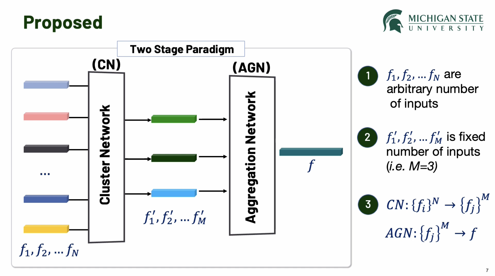

# Cluster and Aggregate: Face Recognition with Large Probe Set
Official repository for the paper
Cluster and Aggregate: Face Recognition with Large Probe Set (NeurIPS 2022). 

> Abstract: Feature fusion plays a crucial role in unconstrained face recognition where inputs
(probes) comprise of a set of N low quality images whose individual qualities
vary. Advances in attention and recurrent modules have led to feature fusion that
can model the relationship among the images in the input set. However, attention
mechanisms cannot scale to large N due to their quadratic complexity and recurrent
modules suffer from input order sensitivity. We propose a two-stage feature fusion
paradigm, Cluster and Aggregate, that can both scale to large N and maintain
the ability to perform sequential inference with order invariance. Specifically,
Cluster stage is a linear assignment of N inputs to M global cluster centers, and
Aggregation stage is a fusion over M clustered features. The clustered features play
an integral role when the inputs are sequential as they can serve as a summarization
of past features. By leveraging the order-invariance of incremental averaging
operation, we design an update rule that achieves batch-order invariance, which
guarantees that the contributions of early image in the sequence do not diminish as
time steps increase. Experiments on IJB-B and IJB-S benchmark datasets show the
superiority of the proposed two-stage paradigm in unconstrained face recognition.

```angular2html
@inproceedings{kim2022adaface,
  title={Cluster and Aggregate: Face Recognition with Large Probe Set},
  author={Kim, Minchul and Liu, Feng and Jain, Anil and Liu, Xiaoming},
  booktitle={Advances in Neural Information Processing Systems},
  year={2022}
}
```


### 5 Minute Video Presentation
[](youtube.com/watch?v=BH0Ikdw7Chc "CAFace 5 minute video presentation")


# Installation and Preparation

## 1. Environment
We use pytorch (1.10.0) in our experiments.
```
pip install -r requirements.txt
```

## 2. Pretrained Models
We release the CAFace model pretrained on AdaFace backbone (last row of Tab.3 in the main paper). 
The backbone is trained on WebFace4M dataset. 
And CAFace is trained on a subset of WebFace4M dataset. 

- Pretrained Model (You need both):
  - Precomputed Class Center for WebFace4M subset: [center_WebFace4MAdaFace_webface4m_subset.pth](https://drive.google.com/file/d/1WmiWjLSsfQU2PTwQAvnrep9u6Jfvd3tR/view?usp=share_link)
  - Pretrained CAFace model:  [CAFace_AdaFaceWebFace4M.ckpt](https://drive.google.com/file/d/1a-nrXcX_h8sLQiTD_mGvmKAG58gE9Oi5/view?usp=share_link)

Place these two files under `pretrained_models/`
```
pretrained_models/
├── CAFace_AdaFaceWebFace4M.ckpt                         
└── center_WebFace4MAdaFace_webface4m_subset.pth         
```

# Testing on Arbitrary Videos (Demo)


|  |   <center>Low Quality Video</center> |
|:---------------------------:|--------------------------------------------------------------------|
|         **Average**         |                                    |
|  **Cluster and Aggregate**  |                      |

- Colored Dots: Cosine Similarity of individual frames to the gallery image. 
- Star: Cosine Similarity of the fused feature.
- Color: Weight of individual frames during feature fusion.

Using Cluster and Aggregate, the fused feature is closer to the gallery image (right) than simply averaging.

```
cd demo
run.sh
```

The demo code creates the above cosine similarity plot. 

# Evaluation

### IJBB and IJBC

For evaluation with IJBB/IJBC you may download the related files from. 
- [InsightFace IJB Dataset](https://github.com/deepinsight/insightface/tree/master/recognition/_evaluation_/ijb) or
- [Download](https://forms.gle/7zURRo2tca96ZKyf6) for convenience, here is an additional link we provide.

Place the downloaded files in `<DATA_ROOT>`, i.e
```
<DATA_ROOT>
└── IJB
    ├── aligned (only needed during training)                                                                                                                      │➜  ffhq mv FFHQ_png_512.zip /hddata/data/ffhq/
    └── insightface_helper
        ├── ijb                                                                                                                             │➜  ffhq mv FFHQ_png_512.zip /hddata/data/ffhq/
        └── meta        
```

Refer to the below code for evaluation.
```bash
cd validation_IJBB_IJBC
bash scripts/run.sh  # DATA_ROOT and IJB_META_PATH has to be specified.
```


# Training from scratch

## WebFace4M Subset (as in paper)

- **Dataset Preparation**: For training Cluster and Aggregate (CAFace) we use pre-computed feature vectors.
  Using a face recognition model trained on WebFace4M, we extract 512 dim feature vectors on a subset of WebFace4M.
  - Precomputed training data features (adaface_webface4m_subset_ir101_style35_augmenterv3_fp16): [precomputed_features](https://drive.google.com/file/d/1U615roLaCGYAmcWRVOJWO1jk6e8Oo3sA/view?usp=share_link)
  - Validation Set (IJBB): [Download](https://forms.gle/7zURRo2tca96ZKyf6)

  - Place the files under `<DATA_ROOT>`
```
<DATA_ROOT>
├── adaface_webface4m_subset_ir101_style35_augmenterv3_fp16/
└── IJB
    ├── aligned (only needed during training)                                                                                                                      │➜  ffhq mv FFHQ_png_512.zip /hddata/data/ffhq/
    └── insightface_helper
        ├── ijb                                                                                                                             │➜  ffhq mv FFHQ_png_512.zip /hddata/data/ffhq/
        └── meta        
```

- Get pretrained face recognition model backbone
  - AdaFace trained on WebFace4M [AdaFaceWebFace4M.ckpt](https://drive.google.com/file/d/19AfGaGZjDqwPQR00kck0GBknePmQOFnU/view?usp=share_link)
  - Place the files under `pretrained_models/`


For training script, refer to
```bash
cd caface
bash scripts/run.sh  # DATA_ROOT has to be specified. 
```

## Extract features using different model
The raw WebFace4M subset dataset used in the paper can be downloaded here [AdaFace4M_subset](https://drive.google.com/file/d/1LuhyxoTdMoVTsrlmZ5_F26Oia3bXsIpu/view?usp=share_link).

We also provide the preprocessing code for creating
1. precomputed feature blob 
   1. First you should extract individual images from the above mxdataset, using [preprocess/extract_images.py](./preprocess/extract_images.py)
   2. Make sure that images are saved correctly (check the color channel)
   3. Then use [preprocess/precompute_features.py](./preprocess/precompute_features.py) to save the features.
2. class center 
   1. [preprocess/make_center.py](./preprocess/make_center.py) creates a `pth` file with class center for the dataset. This will be used in loss calculation.

